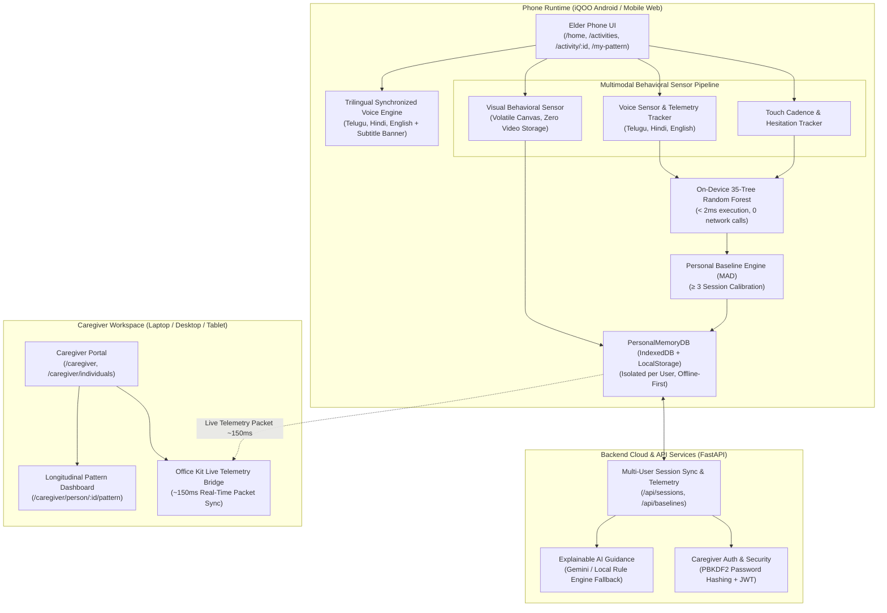

# MindMitra 2.0 (माइंडमित्र / మైండ్‌మిత్ర) 🧠📱
### Your Phone Learns What Normal Looks Like For You
#### Personal Behavioral Memory System • Phone-First Multimodal Cognitive Wellness & Caregiver Office Kit

<p align="center">
  <a href="https://github.com/pavankarthikeyaatchyuta-lab/MindMitra2">
    
  </a>
  
  
  
  
  
</p>

<p align="center">
  
  
  
  
  
  
  
</p>

---

## 🌐 Repository & Live Access Links

- **GitHub Repository**: [https://github.com/pavankarthikeyaatchyuta-lab/MindMitra2](https://github.com/pavankarthikeyaatchyuta-lab/MindMitra2)
- **Elder Phone UI (Local Wi-Fi / iQOO)**: `http://<YOUR_LAN_IP>:5173/home` (Zero-latency on-device execution)
- **Caregiver Portal**: `http://<YOUR_LAN_IP>:5173/caregiver`
- **Caregiver Office Kit (Live Bridge)**: `http://<YOUR_LAN_IP>:5173/caregiver/office-kit`
- **Interactive Backend API Documentation**: `http://localhost:8000/docs`

---

## 🌟 Core Product Concept

> **"Your phone learns what normal looks like for you."**

Traditional cognitive assessment apps treat elders as clinical test-takers, forcing them into stressful tests and comparing their performance against arbitrary population averages.

**MindMitra reimagines this completely.**

MindMitra is **not** a test or a medical diagnosis system. The daily activities are gentle, dignified interaction environments through which the smartphone observes fine-grained micro-behavioral patterns over time across three complementary modalities:

```
TOUCH  (Tap latency, tap cadence, drag hesitation, correction rate)
  +
VOICE  (Spoken response onset, speech duration, pause cadence)
  +
CAMERA (On-device volatile face presence, orientation stability, visual hesitation)
  ↓
BEHAVIORAL FEATURES
  ↓
ON-DEVICE LOCAL ML (< 2ms Decision Tree Ensemble)
  ↓
PERSONAL BASELINE (Median Absolute Deviation over ≥ 3 calibration sessions)
  ↓
CHANGE DETECTION (Relative to the user's OWN baseline, never population averages)
  ↓
ADAPTATION (Pacing easing, difficulty adjustment, reassurance)
```

---

## 🏛️ System Architecture



---

## 🎮 The 5 Core Multimodal Cognitive Activities

MindMitra provides 5 carefully designed, elder-friendly cognitive activities that exercise distinct neurological domains while observing behavioral micro-signals:

| Activity | Cognitive Domain | Modality | Micro-Signals Observed | Adaptive Mechanics |
| :--- | :--- | :--- | :--- | :--- |
| **🧠 Memory Match** | Working Memory & Visual Retention | **Touch + Visual Observation** | `study_duration_ms`, `first_interaction_latency_ms`, repeat mismatches, response pace | **Two-Phase Flow**: Phase 1 Study (7s timer with cards face-up + `[ I'm Ready ]` CTA) $\to$ Phase 2 Recall (hidden cards, matching pairs stay, mismatches flip back) |
| **📋 Daily Routine Recall** | Procedural Sequencing & Chronological Logic | **Touch + Sequencing** | Sequence tap cadence, task placement latency, tap-to-return corrections, Undo rate | **5-Step Reconstruction**: Memorize standard schedule order $\to$ Reconstruct sequence into ordered slots from randomized pool $\to$ Immediate feedback |
| **🔍 Visual Recall** | Distractor Discrimination & Object Recognition | **Touch + Optional Camera** | Selection latency, distractor error rate, face presence ratio, visual hesitation | Distractor elimination (50/50), family photo support, optional front-camera visual behavioral tracking |
| **✨ Pattern Recall** | Spatial Attention & Motor Rhythm | **Touch + Visual** | Inter-tap interval, cadence variance, error recovery, replay requests | Dynamically alters sequence length and observation tempo; in-game replay button |
| **🎙️ Voice Recall** | Episodic Memory & Spoken Retrieval | **Voice / Microphone** | Response onset latency, pause frequency, speech duration, word count | Native speech prompts in Telugu, Hindi, and English; word suggestion chips; non-blocking fallback banner |

---

## 💡 Two-Phase Memory Match UX (Study & Recall)

To protect elder dignity and eliminate unnecessary frustration, Memory Match implements a gentle two-phase flow:

```
┌────────────────────────────────────────────────────────────────────────┐
│                        PHASE 1: STUDY PHASE                             │
│                                                                        │
│  - All cards appear FACE-UP showing celestial symbols (⭐, 🌙, ☀️).   │
│  - Clear instruction: "Take a moment to remember where matching cards are."│
│  - 7-second calm study countdown timer displayed in the header.       │
│  - Explicit action button: [ I'm Ready / నేను సిద్ధంగా ఉన్నాను ]      │
│  - Card matching is disabled; study inspection is NOT penalized.       │
│  - Telemetry: accurately measures study_duration_ms as observation time.│
└───────────────────────────────────┬────────────────────────────────────┘
                                    │ Tapping "I'm Ready" or timer ends
                                    ▼
┌────────────────────────────────────────────────────────────────────────┐
│                        PHASE 2: RECALL PHASE                            │
│                                                                        │
│  - All cards flip smoothly FACE-DOWN displaying "?".                  │
│  - Spoken prompt: "Ready? Let's find the matching pairs."              │
│  - Tapping reveals cards: matching pairs remain face-up.               │
│  - Non-matching pairs show briefly for 1000ms then flip back down.    │
│  - In-game peek hint peeks a matching pair with amber ring highlights. │
│  - Telemetry: first_interaction_latency_ms, avg_response_time_ms,     │
│    mismatches, repeat_errors, completion_time_ms, accuracy.           │
└────────────────────────────────────────────────────────────────────────┘
```

---

## 📊 Strict Real-Time Session Result Integrity

MindMitra guarantees **zero hardcoded, mock, or seeded fallback values** in session results:

- **Clean Empty State**: If a user navigates to `/session-result` without a completed activity, the system renders a friendly *"No Recent Activity Session"* screen with a button to select an activity—**never** fabricating a fake 88% or 1.8s.
- **Strictly Measured Telemetry**:
  - **Accuracy**: Actual percentage computed from matches and penalizable repeat errors.
  - **Response Time**: True measured average latency in seconds.
  - **Study Duration**: Actual observation time spent in Phase 1 (e.g. `5.4s`).
  - **First Card Latency**: Latency to initial card tap after cards flip face-down.
  - **Mismatches / Errors**: Exact count of mismatch events.
  - **Personal Pattern & Consistency**: Computed dynamically via `PersonalBaselineEngine.evaluateAgainstBaseline` (e.g., `'Calibrating (1/3)'`, `'Stable'`, `'Minor Variation'`, or `'Variable'`).
  - **On-Device ML**: Shows real decision tree inference benchmark (e.g., `⚡ 1.1ms`) or `"Measured On-Device"`.

---

## 🗣️ Native Trilingual Voice & Subtitles

MindMitra provides full trilingual support across **Telugu (`te-IN`)**, **Hindi (`hi-IN`)**, and **English (`en-US`)**:

- **Synchronized Audio Banner**: Displays real-time captions with *"Listen Again"* and *"Help / Hint"* actions.
- **Telugu Speech Synthesis**: Native engine matches regional Android voices (`te-IN`, `tel-IN`, `te`, and voices named `telugu` or `తెలుగు`) with automatic `speechSynthesis.onvoiceschanged` lifecycle handling.
- **Telugu Speech Recognition**: Dedicated speech recognizer tuned to `te-IN` locale for Voice Recall.
- **Localized Content**: Daily routine schedules (`ఉదయపు దినచర్య`, `సాయంత్రం దినచర్య`, `వంట పని`), hints, study prompts, and audio summaries all render natively.
- **Persistent Language Preferences**: Language selection persists in `localStorage` across page refreshes and profile changes.
- **Gentle Fallbacks**: When device speech synthesis or speech recognition is unavailable, a clear visual banner guides the elder without blocking interaction.

---

## 👁️ Genuine On-Device Visual Behavioral Sensor

For activities like Visual Recall and Memory Match, MindMitra provides an optional, privacy-respecting front-camera sensor:

- **Strict Privacy**: Analyzes video frames purely in local, volatile HTML5 Canvas memory. **Zero video clips, image crops, or audio streams are ever stored on disk or transmitted over the network**.
- **Behavioral Signals Extracted**:
  - `face_detected_ratio`: Percentage of active interaction frames where the user is facing the device.
  - `orientation_stability`: Consistency ($0.0 - 1.0$) of head orientation relative to the screen.
  - `visual_hesitation_ms`: Cumulative visual observation time before the user initiates a touch action.
- **Elder Control**: Fully optional; can be toggled on or muted at any time via the camera icon in the navigation bar.

---

## 💡 Context-Aware Game Help & Hints

Every game includes an accessible `💡 Hint` button in the top navbar, on the Synchronized Voice Banner, and within the game canvas:

- **Memory Match**: Spoken clue + 2.2-second peek of an unmatched card pair with an animated amber glow ring.
- **Daily Routine**: Spoken clue + visual pulse and `Next Step` badge on the next required task chip in the pool.
- **Visual Recall / Object Recognition**: Eliminates 50% of distractor options with strike-through styling.
- **Pattern Recall**: 5-second replay of the observation sequence so the user can re-watch before tapping.
- **Voice Recall**: Spoken hint + interactive word suggestion chips (`నమస్కారం`, `కుటుంబం`, etc.).
- **Dismissible Hint Callout Banner**: Renders at the top of the activity with spoken audio replay in Telugu, Hindi, and English.

---

## 🧑‍⚕️ Caregiver Workspace & Office Kit Live Bridge

- **Caregiver Login Direct Route**: Logging into a caregiver account navigates directly to the **Caregiver Portal** (`/caregiver`) instead of elder activity screens.
- **Office Kit Live Bridge (`/caregiver/office-kit`)**: Enables a family caregiver or clinician on a laptop to observe live telemetry packets streamed from an elder's phone in **~150 ms**.
- **Longitudinal Trend Inspection**: Visualizes multi-session Median Absolute Deviation (MAD) baselines, showing whether an elder's cadence is stable, calibrating, or exhibiting a meaningful variation.
- **Multi-User Isolation**: User records and baselines are strictly isolated by unique user IDs with database-level ownership verification.

---

## ⚡ Empirical Benchmarks & Guardrails

```
┌────────────────────────────────────────────────────────────────────────────────────────┐
│             BROWSER RUNTIME BENCHMARK (Chromium V8 • Mobile Device Profile)            │
│                                                                                        │
│  - Single Model Inference Latency:   Sub-millisecond (< 0.100 ms P95 in V8 engine)     │
│  - Python Reference Disagreement:    0.00% (0 / 500 test samples vs Scikit-Learn)      │
│  - End-to-End Client Adaptation:     ~1.5 - 2.0 ms (Touch ──► ML ──► Personal Baseline)│
│  - Office Kit Cross-Device Sync:     ~150 ms (Zero-Reload Live Sync to Laptop)         │
│  - Airplane Mode Offline Operation:  100% Operational (0 Network Requests in Core Loop)│
│  - Raw Audio / Photo Cloud Upload:   0 Bytes (Zero media upload - Privacy Guaranteed)  │
└────────────────────────────────────────────────────────────────────────────────────────┘
```

---

## 🧪 Comprehensive Automated Test Suites

```bash
# 1. Memory Match Two-Phase (Study & Recall) & Session Result Data Integrity QA (19/19 passed)
node frontend/scripts/test_memory_match_study_phase.mjs

# 2. Context-Aware Hints & Help QA Suite (14/14 passed)
node frontend/scripts/test_game_hints_and_help.mjs

# 3. Multimodal Sensors, Telugu Voice & Reconstructive Routine QA (26/26 passed)
node frontend/scripts/test_restored_games_and_language.mjs

# 4. Caregiver Flow & Direct Routing QA Suite
node frontend/scripts/test_caregiver_flow_qa.mjs

# 5. Offline Core & Baseline Storage Verification
node frontend/scripts/test_offline_core_verification.mjs

# 6. Backend Pytest Suite (43/43 passed)
python -m pytest backend/

# 7. Frontend Production Compilation (0 errors)
npm run build
```

---

## 🚀 Quickstart & Local Setup

### Prerequisites
- Node.js 18+
- Python 3.10+
- npm

### 1. Clone & Install
```bash
git clone https://github.com/pavankarthikeyaatchyuta-lab/MindMitra2.git
cd MindMitra2
```

### 2. Run Backend (Terminal 1)
```bash
cd backend
pip install -r requirements.txt
python -m uvicorn main:app --host 0.0.0.0 --port 8000 --reload
```

### 3. Run Frontend (Terminal 2)
```bash
cd frontend
npm install
npm run dev -- --host 0.0.0.0 --port 5173
```

### 4. Local Access Points
- **Elder Phone UI**: `http://localhost:5173/home`
- **Phone on Local Wi-Fi (iQOO Android)**: `http://<YOUR_LAN_IP>:5173/home`
- **Caregiver Portal**: `http://localhost:5173/caregiver`
- **Office Kit Live Bridge**: `http://localhost:5173/caregiver/office-kit`
- **Interactive Backend API Docs**: `http://localhost:8000/docs`

---

## ⚖️ Ethical Guardrails & Non-Clinical Framing

MindMitra is an **assistive cognitive engagement, social companion, and personal behavioral observation tool** — **NOT a medical diagnostic device**.
- 🚫 **No Clinical Diagnoses**: MindMitra does not diagnose, treat, or claim to cure dementia, Alzheimer's, or any neurological condition.
- 🛡️ **Mandatory Disclaimer**: All dashboards and session views include clear non-clinical explanations for caregivers and families.
- 🔒 **Data Sovereignty**: Family photos and behavioral telemetry remain strictly isolated under caregiver account ownership. No raw media is uploaded to external clouds.

---

## 👥 Authors & Acknowledgments

- **Lead Architect & Developer**: Atchyuta Pavan Karthikeya
- **Repository**: [https://github.com/pavankarthikeyaatchyuta-lab/MindMitra2](https://github.com/pavankarthikeyaatchyuta-lab/MindMitra2)
- **Built for**: iQOO Hackathon 2026
