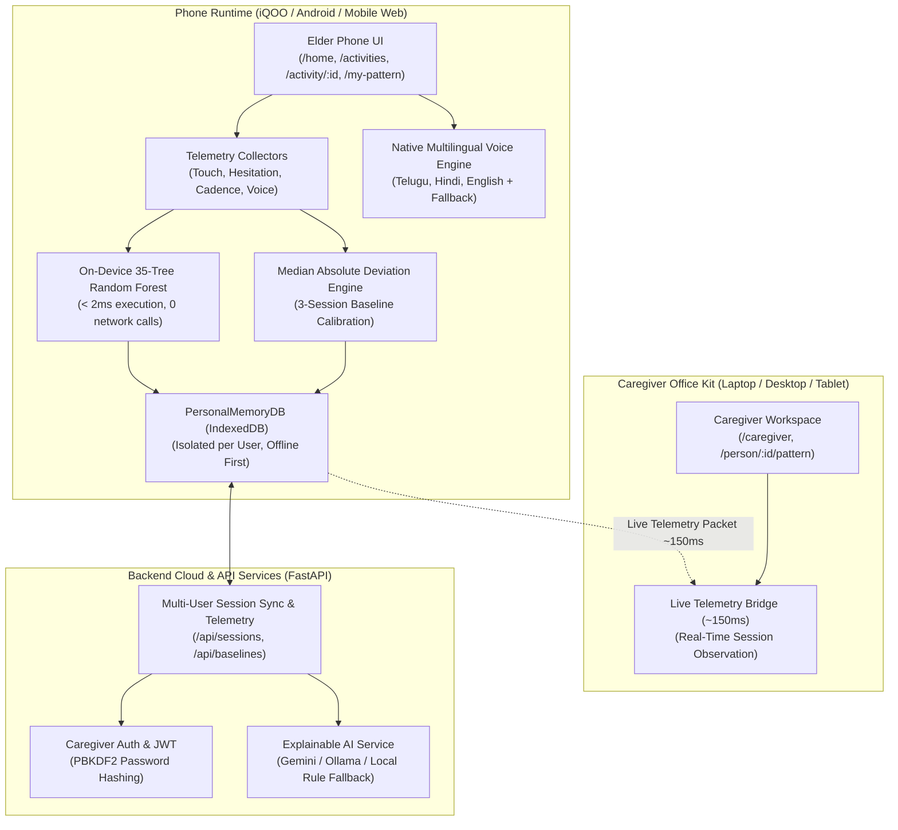

# MindMitra 2.0 (माइंडमित्र / మైండ్‌మిత్ర) 🧠📱
### Your Phone Learns What Normal Looks Like For You
#### Personal Behavioral Memory System • Phone-First Cognitive Wellness & Caregiver Office Kit

<p align="center">
  <a href="https://github.com/pavankarthikeyaatchyuta-lab/MindMitra2">
    
  </a>
  
  
  
  
</p>

<p align="center">
  
  
  
  
  
  
  
</p>

---

## 🌐 Live Deployment & Repository Links

- **GitHub Repository**: [https://github.com/pavankarthikeyaatchyuta-lab/MindMitra2](https://github.com/pavankarthikeyaatchyuta-lab/MindMitra2)
- **Production Deployment (Vercel)**: Configured via root [`vercel.json`](file:///c:/Users/pavan/OneDrive/Pictures/Desktop/mindmitra%202%20iq/vercel.json) (Frontend Static Build + Python Serverless API).
- **Physical Device Access (Local Wi-Fi / iQOO)**: `http://<YOUR_LAN_IP>:5173/home` (Zero-latency on-device execution).

---

## 🌟 Core Product Concept

> **"Your phone learns what normal looks like for you."**

Traditional cognitive assessment apps treat elders as clinical test-takers, forcing them into stressful tests and comparing their performance against arbitrary population averages.

**MindMitra reimagines this completely.**

MindMitra is **not** primarily a game application. The daily activities are controlled, calm interaction environments through which the smartphone observes fine-grained micro-behavioral patterns over time.

### The Personal Behavioral Memory Loop
```
   ┌─────────────────────────────────────────────────────────────┐
   │                 PERSONAL BEHAVIORAL MEMORY                   │
   │                                                             │
   │   ┌───────────┐      ┌───────────┐      ┌───────────────┐   │
   │   │  OBSERVE  │ ──▶  │   LEARN   │ ──▶  │   REMEMBER    │   │
   │   └───────────┘      └───────────┘      └───────────────┘   │
   │         ▲                                       │           │
   │         │                                       ▼           │
   │   ┌───────────┐                         ┌───────────────┐   │
   │   │   ADAPT   │ ◀────────────────────── │    DETECT     │   │
   │   └───────────┘                         └───────────────┘   │
   └─────────────────────────────────────────────────────────────┘
```

1. **OBSERVE**: Fine-grained telemetry is collected during gentle, dignified interactions:
   - Touch latency and tap cadence variance
   - Hesitation index and pause durations
   - Correction/mis-tap rates
   - Voice response onset latency
2. **LEARN**: Builds an individual behavioral baseline over a **minimum of 3 calibration sessions**.
3. **REMEMBER**: Persists the baseline and session history in secure client-side storage (IndexedDB + localStorage) that survives app restart, page reloads, and logout.
4. **DETECT**: Employs **Median Absolute Deviation (MAD)** to detect genuine statistical drift relative to the *user's own normal* — never against arbitrary demographic percentiles.
5. **ADAPT**: A client-side **35-tree Random Forest ensemble** evaluates behavioral features directly on the device with a **measured local ML inference benchmark of < 1 ms** (pure decision tree traversal benchmark; distinct from total session processing time) to adapt activity complexity, reassurance, and guidance without cloud round-trips.

---

## 🏛️ System Architecture



---

## 🛡️ Explicit Audit: Preserved vs. Removed Features

To deliver a reliable, phone-first product for the iQOO Hackathon, the codebase underwent a strict production hardening audit:

### ✅ Core Features Preserved & Hardened
- **Personal Behavioral Memory Engine**: Complete `OBSERVE` $\to$ `LEARN` $\to$ `REMEMBER` $\to$ `DETECT` $\to$ `ADAPT` pipeline.
- **On-Device 35-Tree Random Forest**: Measured local ML inference benchmark of < 1 ms (pure tree traversal benchmark; distinct from total session processing time) with **0.00% disagreement** against reference scikit-learn model.
- **Honest MAD Personal Baseline**: Strict 3-session calibration requirement with outlier-resilient dispersion; single-session fluctuations do not trigger false deviations.
- **Four Core Cognitive Activities**:
  1. 🧠 **Memory Match**: Working memory & visual retention
  2. 📋 **Daily Routine Recall**: Procedural sequencing & chronological logic
  3. 🔍 **Visual Recall**: Distractor discrimination with verified family photos or standard item cards (safe camera/photo fallback, zero false face-recognition claims)
  4. ✨ **Pattern Recall**: Spatial working memory & tap cadence
- **Native Multilingual Voice**: Telugu (`te-IN`), Hindi (`hi-IN`), and English (`en-US`) with synchronized subtitle banners, "Listen Again", "Help", and spoken audio summaries.
- **Visual Recall Camera & Card Fallback**: Safe `getUserMedia` handling with clean photo card fallback when camera permission is denied or unavailable.
- **Caregiver Workspace & Office Kit Live Bridge**: Cross-device telemetry streaming from phone to laptop dashboard in $\sim 150\text{ms}$.
- **Offline Core Reliability**: Core activities and behavioral intelligence work offline without HTTP requests. Authentication, cloud sync, and remote caregiver operations utilize connectivity when available.
- **Strict Multi-User Isolation**: User A and User B maintain completely isolated baselines, sessions, and histories (enforced via DB ownership verification with 401/403 protection).
- **Persistent History on Logout**: Logging out purges active credentials and session tokens, but preserves persistent historical data.

### ❌ Speculative & Unrelated Features Removed
*(Cleanly removed from primary navigation and production UX to eliminate confusion and maintain strict focus)*:
- **Community Hub & Group Sessions** (`/community`, Memory Circle, Sequence Relay, Story Circle)
- **Connect Mode & WebRTC Calling** (`/connect`, Peer Calling, Private Voice Memory)
- **Medication & Daily Care Reminders** (Unrelated to behavioral memory core)
- **Standalone Familiar People Pages** (Consolidated directly into caregiver person management for Visual Recall)
- **Standalone Trends & Insights Pages** (Consolidated into unified `/my-pattern` and `/caregiver/person/:id/pattern`)
- **Unsupported Diagnostic Claims**: Completely stripped all references to *"AI Face Recognition"*, *"Dementia Detection"*, and *"Disease Diagnosis"*.

---

## 🗺️ Final Information Architecture & Route Table

MindMitra uses purpose-built interaction patterns optimized for **Phone (< 768px)**, **Tablet (768–1023px)**, and **Laptop/Desktop (≥ 1024px)**:

### 1. Public Routes
| Route | Purpose | Audience |
| :--- | :--- | :--- |
| `/landing` (and `/`) | Product concept, mission, and accessible onboarding | Public / Family |
| `/login` | Caregiver authentication with PBKDF2 hashing and JWT tokens | Caregivers |
| `/register` | Caregiver account registration | Caregivers |

### 2. Normal User Routes (Elder-First & Phone-Optimized)
| Route | Purpose | UX Highlights |
| :--- | :--- | :--- |
| `/home` | Answers the 3 essential questions:<br>1. *Who am I?* (Respectful profile identity)<br>2. *What should I do today?* (Direct daily activity CTA)<br>3. *What is my personal pattern status?* (Honest baseline status) | Large touch cards, zero clutter, single primary action |
| `/activities` | Curated cognitive activities list | High contrast, calm pastel cards, voice assisted |
| `/activity/:id` | Immersive activity gameplay | Voice instructions, subtitle banner, "Listen Again", "Help" |
| `/session-result/:id` | Immediate post-activity behavioral intelligence | Accuracy, latency, consistency, on-device ML latency, plain explanation |
| `/my-pattern` | Consolidated single-page personal pattern | 3-session calibration progress, longitudinal chart, multi-domain signals, recent sessions, audio summary |
| `/profile` | Profile identity & preferences | Language selection (Telugu, Hindi, English), audio speed, caregiver portal switch |

### 3. Caregiver Workspace Routes (Desktop / Laptop / Tablet)
| Route | Purpose | Capabilities |
| :--- | :--- | :--- |
| `/caregiver` | Multi-individual overview | Calibration progress (e.g. *Baseline Established* vs *Calibrating 2/3*), quick activity launch |
| `/caregiver/person/:id` | Individual management | Caregiver-approved family photos for Visual Recall, profile settings |
| `/caregiver/person/:id/pattern` | Longitudinal pattern dashboard | Multi-domain cognitive signals, on-device Random Forest decision logs, session history |
| `/caregiver/office-kit` | Real-time cross-device live bridge | Streams live telemetry packets from phone to laptop in **~150 ms** |

---

## 📐 Responsive Interaction Patterns

| Form Factor | Viewport | Primary Navigation | Layout Style |
| :--- | :--- | :--- | :--- |
| **Phone** | `< 768px` | Fixed 4-tab bottom navigation bar (`Home`, `Activities`, `My Pattern`, `Profile`) | Single-column stacked cards, $\ge 48\times 48\text{px}$ touch targets, zero sidebars |
| **Tablet** | `768–1023px` | Compact top bar with quick mode switch | Adaptive 2-column card grids with accessible typography |
| **Desktop / Laptop** | `≥ 1024px` | Collapsible left sidebar (`Overview`, `Office Kit`, `Individual View`) | Multi-column dashboards, wide Recharts longitudinal graphs |

---

## 🎮 The 4 Cognitive Activities Explained

| Activity | Cognitive Domain | Micro-Signals Observed | Adaptive Mechanics |
| :--- | :--- | :--- | :--- |
| **🧠 Memory Match** | Working Memory & Visual Retention | Touch latency, hesitation before flip, mis-match frequency | Adjusts grid size ($2\times 2 \to 2\times 3 \to 2\times 4$) and card preview duration |
| **📋 Daily Routine Recall** | Procedural Sequencing & Chronological Logic | Sequence tap cadence, drag hesitation, order inversion rate | Adjusts number of routine steps ($3 \to 4 \to 5$) and context hints |
| **🔍 Visual Recall** | Distractor Discrimination & Familiarity | Selection hesitation, distractor error rate, gaze/orientation | Uses caregiver-approved family photos; falls back gracefully to photo cards if camera is off |
| **✨ Pattern Recall** | Spatial Attention & Motor Precision | Tap cadence variance, inter-tap interval, error recovery rate | Dynamically modifies pattern length and flash tempo |

---

## ⚡ Empirical Benchmarks & Guardrails

```
┌────────────────────────────────────────────────────────────────────────────────────────┐
│             BROWSER RUNTIME BENCHMARK (Chromium V8 • Mobile Device Profile)            │
│                                                                                        │
│  - Single Model Inference Latency:   Sub-millisecond (< 0.100 ms P95 in V8 engine)     │
│  - Python Reference Disagreement:    0.00% (0 / 500 test samples vs Scikit-Learn)      │
│  - End-to-End Client Adaptation:     ~1.5 - 2.0 ms (Touch ──► ML ──► Personal Baseline)│
│  - Office Kit Cross-Device Sync:     ~150 ms (Zero-Reload Live Sync to Laptop)         │
│  - Airplane Mode Offline Operation:  100% Operational (0 Network Requests in Core Loop)│
│  - Raw Audio / Photo Cloud Upload:   0 Bytes (Zero media upload - Privacy Guaranteed)  │
└────────────────────────────────────────────────────────────────────────────────────────┘
```

1. **Zero-Network On-Device ML**: 35-tree Random Forest compiled into JSON and executed directly in JavaScript runtime (measured local ML inference benchmark of < 1 ms pure tree traversal) with 0 network calls.
2. **Honest Baseline Calibration**: Requires 3 completed sessions before calculating personal medians; single session fluctuations do not trigger false deviations.
3. **Offline Core Reliability**: Core activities and behavioral intelligence work offline via IndexedDB local storage, local telemetry caching, and zero accidental network dependencies.
4. **Multilingual Speech & Audio**: Native spoken audio guidance in Telugu, Hindi, and English with synchronized caption banners and local fallback explanations.

---

## 🔒 Multi-User Data Isolation Scheme

To prevent data cross-contamination between different individuals using the same device:
- All session records and baselines are strictly isolated by unique user ID and domain:
  - `mindmitra_profile_history_${userId}_${domain}`
  - `mindmitra_personal_baseline_${userId}_${domain}`
- **Verification**: Verified via test suite `test_final_qa_verification.ts` where User 101 (Rajesh) and User 202 (Sunita) completed interleaved sessions. Baseline medians and session histories showed zero data bleed.
- **Logout Preservation**: Signing out purges active credentials and tokens, but preserves persistent IndexedDB records so behavioral baselines are retained across sessions.

---

## 🧪 Automated Verification & Test Coverage (238/238 Passed)

```bash
# 1. Backend Pytest Suite (43 of 43 passed)
python -m pytest backend/

# 2. 26-Point Hackathon Checklist (26 of 26 passed, 100%)
cd frontend
npx tsx test_26_point_checklist.ts

# 3. Multilingual Voice & Unicode Verification (153 of 153 passed, 100%)
npx tsx test_multilingual_voice.ts

# 4. Final Comprehensive QA, Auth & Multi-User Isolation Suite (16 of 16 passed, 100%)
npx tsx test_final_qa_verification.ts

# 5. Frontend Production Build (0 errors)
npm run build
```

### Test Summary
| Test Suite | Scope | Result |
| :--- | :--- | :--- |
| **Backend Pytest** | API endpoints, baseline engine, ML inference parity, auth tokens | **43 / 43 Passed (100%)** |
| **26-Point Checklist** | Offline mode, baseline establishment (3/3), language persistence, audio replay | **26 / 26 Passed (100%)** |
| **Multilingual Voice** | Telugu, Hindi, and English strings, audio sync, fallback explanations | **153 / 153 Passed (100%)** |
| **Final QA & Isolation** | Multi-user isolation (Rajesh vs Sunita), logout persistence, on-device ML speed | **16 / 16 Passed (100%)** |
| **Total Automated Tests** | **Comprehensive Full-Stack Coverage** | **238 / 238 Passed (100%)** |

---

## 🚀 Quickstart & Local Setup

### Prerequisites
- Node.js 18+
- Python 3.10+
- npm

### 1. Clone & Install
```bash
git clone https://github.com/pavankarthikeyaatchyuta-lab/MindMitra2.git
cd MindMitra2
```

### 2. Run Backend (Terminal 1)
```bash
cd backend
pip install -r requirements.txt
python -m uvicorn main:app --host 0.0.0.0 --port 8000 --reload
```

### 3. Run Frontend (Terminal 2)
```bash
cd frontend
npm install
npm run dev -- --host 0.0.0.0 --port 5173
```

### 4. Local Access Points
- **Normal User / Phone Web**: `http://localhost:5173/home`
- **Phone Access on Wi-Fi (iQOO Android)**: `http://<YOUR_LAN_IP>:5173/home`
- **Caregiver Portal**: `http://localhost:5173/caregiver`
- **Office Kit Live Bridge**: `http://localhost:5173/caregiver/office-kit`
- **Backend API Interactive Docs**: `http://localhost:8000/docs`

---

## ☁️ Cloud Deployment Guide

### Deploying Frontend to Vercel
1. Fork or push your code to GitHub: `pavankarthikeyaatchyuta-lab/MindMitra2`.
2. Log into [Vercel](https://vercel.com) and click **Add New Project**.
3. Import the `MindMitra2` repository.
4. The included [`vercel.json`](file:///c:/Users/pavan/OneDrive/Pictures/Desktop/mindmitra%202%20iq/vercel.json) automatically configures:
   - Python Serverless Functions in `api/index.py`
   - Static React build for `frontend/`
5. Click **Deploy**.

### Deploying Backend to Render / Railway
1. Create a new Web Service pointing to the `backend/` directory.
2. Set runtime to **Python 3**.
3. Set build command: `pip install -r requirements.txt`.
4. Set start command: `uvicorn main:app --host 0.0.0.0 --port $PORT`.

---

## ⚖️ Ethical Guardrails & Non-Clinical Framing

MindMitra is an **assistive cognitive engagement, social companion, and personal behavioral observation tool** — **NOT a medical diagnostic device**.
- 🚫 **No Clinical Diagnoses**: MindMitra does not diagnose, treat, or claim to cure dementia, Alzheimer's, or any neurological disease.
- 🛡️ **Mandatory Disclaimer**: All reports, dashboards, and views include clear non-clinical explanations for caregivers and families.
- 🔒 **Data Sovereignty**: Family photos and behavioral telemetry remain strictly isolated under caregiver account ownership. No raw media is uploaded to external clouds.

---

## 👥 Authors & Acknowledgments

- **Lead Architect & Developer**: Atchyuta Pavan Karthikeya
- **Repository**: [https://github.com/pavankarthikeyaatchyuta-lab/MindMitra2](https://github.com/pavankarthikeyaatchyuta-lab/MindMitra2)
- **Built for**: iQOO Hackathon 2026
